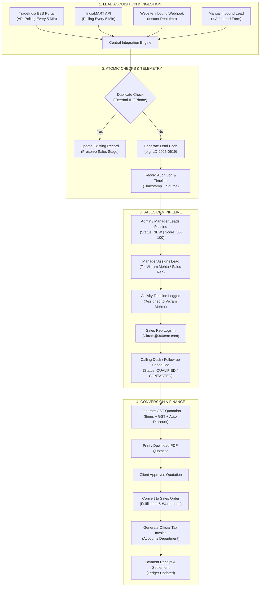

# 🚀 360CRM Enterprise Platform — A to Z Complete Lead Lifecycle & Client Demonstration Guide

> **Document Version**: 2.0 (Production Architecture)  
> **Prepared For**: Client Walkthrough, Management & Sales Operation Teams  
> **Platform URL**: [http://localhost:5180](http://localhost:5180)  
> **Backend API Server**: [http://localhost:5055](http://localhost:5055)  

---

## 📌 Executive Summary (Client Overview)

Is document me **360CRM Enterprise** ka complete end-to-end workflow step-by-step samjhaya gaya hai:
1. **Lead Kahan Se Aati Hai?** (TradeIndia B2B Portal, IndiaMART, Website Webhooks, Manual Inbound).
2. **Background Automation**: Har 5 minute me automated sync kaise chalta hai aur duplicates kaise roke jate hain.
3. **Login / Logout & Employee Security**: Kaunsa employee/admin kis role se login hua, session logging kaise hoti hai.
4. **Lead Assignment**: Lead Sales Executive ko kaise assign hoti hai.
5. **Calling & Follow-up Desk**: Executive call karke status kaise update karta hai.
6. **Quotation to Invoice**: Lead se Quotation (GST PDF), Quotation se Sales Order, aur Sales Order se Tax Invoice & Payment Receipt ka complete safar.

---

## 🗺️ Master End-to-End Visual Workflow



---

## 🔑 1. Login, Role Access & Logout (A to Z)

Platform me **Role-Based Access Control (RBAC)** aur multi-tenant security integrated hai. Har user ka action, login time aur session system me trace hota hai.

### A. Ready Demo Accounts (Instant 1-Click Login):

| Role | Demo Email | Password | Allowed Access / Responsibilities |
| :--- | :--- | :--- | :--- |
| **Admin / Director** | `admin@360crm.com` | `admin123` | Full Access: CRM, Integrations, HR, Accounts, Assigning, Reports |
| **Super Admin** | `shivamshishodia5541@gmail.com` | `admin123` | Enterprise Multi-Tenant Control, System Logs, Master Settings |
| **Sales Representative** | `vikram@360crm.com` | `admin123` | Leads Pipeline, Assigned Calling Desk, Follow-ups, Quotations |
| **Sales Representative 2**| `priya@360crm.com` | `admin123` | Calling Desk, Customer Quotations, Assigned Leads Only |
| **Store & Inventory Manager**| `store@360crm.com` | `admin123` | Products, Stock Inward (GRN), Stock Outward, Purchase Orders |
| **Accounts & Finance** | `accounts@360crm.com` | `admin123` | Tax Invoices, Receipts, Debtors Aging, Expenses, Credit Notes |

---

### B. Login Flow (Kadam-dar-Kadam):
1. Browser me **[http://localhost:5180](http://localhost:5180)** kholein.
2. Login screen par demo cards dikhenge:
   - **"Admin"** card par click karein ya Email (`admin@360crm.com`) aur Password (`admin123`) dalein.
3. **"Sign In to 360CRM"** button click karein.
4. **System Action**: 
   - Backend JWT token verify karta hai.
   - `360_backend/data/auditLogs.json` me turant login audit log record hota hai:
     `"action": "LOGIN", "entity": "Authentication", "details": "User Rohan Sharma (ADMIN) logged in successfully"`
   - Dashboard par organization title *"SHIV SHAKTI ERP / CRM"* ke saath live pipeline khul jati hai.

---

### C. Logout Flow:
1. Screen ke top-right corner me user avatar profile icon par click karein (e.g., `RS` Rohan Sharma).
2. Dropdown menu me **"Sign Out"** button dabayein.
3. JWT session token browser storage se safely clear ho jayega aur aap securely login screen par wapas aa jayenge.

---

## 📡 2. Lead Kahan Se Aati Hai? (Lead Ingestion Sources)

360CRM char alag-alag acquisition channels se leads ko capture karta hai:

### Source A: TradeIndia B2B Portal (Automated Polling)
- **API Endpoint**: `https://www.tradeindia.com/utils/my_buy_leads.html`
- **Schedule**: Background cron har **5 minute** me automatic chalta hai.
- **Safety**: 15-minute rate limit cooldown protection aur 24-hour day-by-day windowing lagai gayi hai.
- **Captured Fields**: Buyer Name, Contact Mobile, Email, Company Name, City, State, Product Inquiry, Quantity, Buyer Message.

### Source B: IndiaMART Direct Lead API
- **API Endpoint**: `https://mapi.indiamart.com/wservce/crm/crmListing/v2/`
- **Schedule**: Recurring 5-minute background polling.
- **Captured Fields**: Buyer Name, Mobile, Email, Subject, City, State, Requirement Details.

### Source C: Website Webhooks (Real-Time 0-Second Delay)
- **Webhook Endpoint**: `POST http://localhost:5055/api/webhooks/leads/int_3`
- Website landing page ya contact form submit hote hi 1 second ke andar lead CRM me create ho jati hai.

### Source D: Manual Inbound Entry (Phone Call / Walk-In)
- Sales office me direct phone call aane par manager **"+ Add New Lead"** button dabakar lead feed kar sakta hai.

---

## 🔄 3. Background Sync Aur Duplicate Protection Rule

Jab bhi TradeIndia ya kisi portal se lead aati hai:

```text
TradeIndia Payload ──► [Duplicate Strategy Filter]
                              │
               ┌──────────────┴──────────────┐
               ▼                             ▼
       [Lead ID Already Exists]      [New Unique Inquiry]
               │                             │
    Safe Metadata Update Only         New Lead Created
 (Status/Representative Safe)         (Code: LD-2026-XXXX)
               │                             │
               └──────────────┬──────────────┘
                              ▼
                 Activity Timeline Logged
```

1. **Duplicate Protection**:
   Agar wahi phone number ya TradeIndia enquiry ID pehle se CRM me hai, to duplicate record create nahi hota. Existing lead update hoti hai, jisse sales rep ki ongoing calling stage kharab na ho.
2. **Lead Scoring**:
   - Phone + Email verified: `+20 points`
   - Company name available: `+15 points`
   - Quantity specified: `+10 points`
   - Lead Score automatically `50` se `100` ke beech calculate hota hai.

---

## 💼 4. Lead Aane Ke Baad Ka Complete Safar (Step-by-Step)

### Step 1: Nayi Lead Pipeline Me Dikhna
- **Navigation**: Sidebar me **Sales ➔ Leads** par jayein.
- **Screen View**: 
  - Top par **"TODAY'S INBOUND"** count increment ho jata hai.
  - Table me sabse upar nayi lead green arrival badge ke saath aati hai:
    - *Example*: `LD-2026-0619` | **Rameshwar Patel** | *Shree Vallabh Chemical Industries* | Phone: `+919825167890` | Source: `TradeIndia`.
  - Pipeline Status: **`NEW`** | Assigned Rep: **`Unassigned`**.

---

### Step 2: Manager Lead Assign Karta Hai
1. Admin/Manager lead row ke right side me **Assign Icon (User with Checkmark)** par click karta hai.
2. Modal khulta hai:
   - **Sales Representative Dropdown**: Select karein `Vikram Mehta (Sales)`.
   - **Handover Notes**: `Buyer ko urgent 100 rolls thermal ribbon chahiye. Aaj hi call karein.`
3. **"Confirm Assignment"** button dabayein.
4. **Result**: 
   - Row me Assigned Rep: **`Vikram Mehta`** ho jata hai.
   - Activity Timeline me log ho jata hai: `"Lead assigned to Vikram Mehta by Admin"`.

---

### Step 3: Sales Executive (Vikram) Login Karta Hai Aur Call Karta Hai
1. Top-Right se Logout karke **Vikram Mehta** (`vikram@360crm.com` / `admin123`) se login karein.
2. Vikram ko apni assigned leads dikhti hain.
3. Lead row me **Eye Icon (View Details)** par click karein ➔ 360° Lead Drawer open hota hai:
   - Buyer contact details, WhatsApp button, phone call button.
4. Vikram buyer se baat karne ke baad status update karta hai:
   - Status: **`QUALIFIED`** ya **`IN_DISCUSSION`**.
   - Stage: **`REQUIREMENT_GATHERED`**.
5. **"+ Schedule Follow-up"** button dabakar agle din ka reminder set karta hai (e.g. `Tomorrow 11:00 AM - Rate Negotiation Call`).

---

### Step 4: Quotation Generate Karna (GST & Pricing)
Jab buyer price quotation maangta hai:
1. Sidebar me **Sales ➔ Quotations** par click karein.
2. **"+ Create Quotation"** button dabayein.
3. Form fill karein:
   - **Customer / Lead**: Select karein `Rameshwar Patel (Shree Vallabh Chemical Industries)`.
   - **Product Name**: Select karein `Thermal Transfer Ribbon Resin Grade 110mm x 300m`.
   - **Quantity**: `100` Rolls.
   - **Unit Price**: `₹450`.
   - **GST %**: `18%`.
   - **Shipping Charges**: `₹1200`.
4. **"Generate Quotation"** dabayein:
   - Quotation Code `QT-2026-XXXX` create ho jati hai with automated Subtotal, CGST, SGST, aur Grand Total.
5. Row me **Print / PDF Icon** dabakar client ko professional GST Quotation preview dikhayein ya **Download PDF** karein.

---

### Step 5: Sales Order Me Conversion (Fulfillment)
1. Client se confirmation milne par Quotation row me **"Approve Quotation"** click karein.
2. Uske baad **"Convert to Sales Order"** button dabayein.
3. 1-Click me ye record **Sales ➔ Sales Orders** me transfer ho jata hai (`SO-2026-XXXX`).
4. Warehouse team stock check karke dispatch prepare karti hai.

---

### Step 6: Tax Invoice Aur Payment Receipt (Accounts Department)
1. Converted Sales Order row me **"Create Tax Invoice"** button dabayein.
2. Ye direct **Accounts & Finance ➔ Invoices** me transfer ho jata hai:
   - Official Tax Invoice `INV-2026-XXXX` ban jata hai.
3. Payment aane par Accounts executive **"Record Payment Receipt"** dabata hai:
   - Payment Mode: `NEFT / Bank Transfer`
   - Transaction Reference / UTR Number: `HDFC9823471029`
   - Amount Received: Full Settlement.
4. Invoice status **`PAID`** ho jata hai aur Customer Ledger me credit entry post ho jati hai.

---

## 📊 Summary: Kis Screen Par Kya Dekhein (Client Verification Checklist)

| Step | Page / URL | Kya Check Karein | Expected Result |
| :---: | :--- | :--- | :--- |
| **1** | [http://localhost:5180](http://localhost:5180) (Login) | Demo Cards | 1-Click login without typing password |
| **2** | **Marketing ➔ Integrations** | TradeIndia Card | Status: `ACTIVE`, Health: `Operational & Ready` |
| **3** | **Sales ➔ Leads** | Top KPI Cards | **"TODAY'S INBOUND"** count active hai |
| **4** | **Sales ➔ Leads Table** | Top 2 Rows | TradeIndia leads with `New` arrival tag |
| **5** | **Lead Action Buttons** | Assign Icon / Eye Icon | Assign rep to sales executive & view dossier |
| **6** | **Sales ➔ Quotations** | Quotations List | Professional GST Quotation with PDF download |
| **7** | **Sales ➔ Sales Orders** | Order List | Converted sales order ready for warehouse dispatch |
| **8** | **Accounts ➔ Invoices** | Invoice Dossier | Official Tax Invoice with payment settlement |

---

> **End of Guide**  
> *360CRM Enterprise — Engineered for Real-World B2B Manufacturing & Distribution Operations.*
