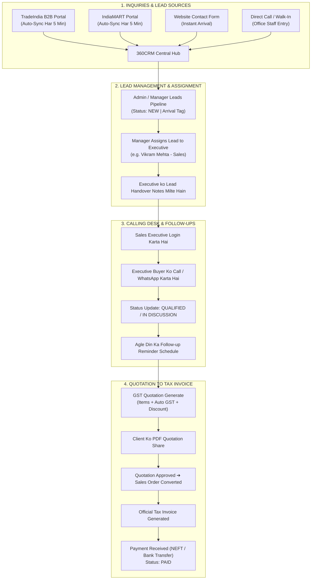

# 🚀 360CRM Enterprise — Complete Lead to Sales & Billing Operations Guide

> **Prepared For**: Client Operations Walkthrough & Management Demonstration  
> **CRM Portal**: [http://localhost:5180](http://localhost:5180)  

---

## 📌 Executive Summary (Client Overview)

Is document me **360CRM Enterprise** ka complete operational workflow aasan bhasha me samjhaya gaya hai:
1. **Lead Kahan Se Aayi?** (TradeIndia, IndiaMART, Website Inquiry, ya Direct Phone Call).
2. **Automatic Background Sync**: Portal se CRM me inquiries har 5 minute me apne aap kaise aati hain.
3. **Login & Employee Roles**: Admin aur Sales Executives apne account me login/logout kaise karte hain.
4. **Lead Assignment**: Manager kisi bhi lead ko specific Sales Executive ko kaise saumpte hain.
5. **Calling & Follow-up Desk**: Executive client se baat karke status aur reminder kaise set karta hai.
6. **Quotation, Order & Billing**: Rate quotation generate karna, PDF print karna, Sales Order me convert karna, aur Tax Invoice bana kar payment receive karna.

---

## 🗺️ Master Business Workflow (Visual Overview)

---

## 🔑 1. Login, User Roles & Logout Flow

Platform me har department aur employee ke liye alag-alag secure roles bane hue hain:

### A. Role-Based Login Credentials:

| Department / Role | Email ID | Password | Portal Par Kya Kaam Kar Sakte Hain |
| :--- | :--- | :--- | :--- |
| **Director / Admin** | `admin@360crm.com` | `admin123` | Pure business ka full access, lead assigning, reports aur control |
| **Sales Representative (Arjun Singh)** | `employee@360crm.com` | `admin123` | Apni assigned leads, calling desk, follow-ups aur quotation banana |

---

### B. Login Kaise Karein (Kadam-dar-Kadam):
1. Browser me **[http://localhost:5180](http://localhost:5180)** kholein.
2. Login screen par ready **Demo Cards** bane hain:
   - Agar aapko Admin dekhna hai to direct **"Admin"** card click karein.
   - Agar Sales Executive dekhna hai to **"Sales Executive"** click karein.
3. **"Sign In to 360CRM"** button click karein.
4. Dashboard open ho jayega aur company ka live business pipeline dikhega.
5. Har employee kab login hua aur kab logout hua, iski entry system ke activity timeline me automatic note hoti hai.

---

### C. Logout Kaise Karein:
1. Screen ke top-right corner me apne **User Avatar (Profile Icon)** par click karein.
2. Dropdown menu se **"Sign Out"** click karein. Aap safely logout hokar login screen par aa jayenge.

---

## 📡 2. Lead Kahan Se Aati Hai? (4 Inbound Channels)

Aapke business me 4 jagahon se buyers ki inquiries CRM me aati hain:

1. **TradeIndia Portal Connector**:
   - TradeIndia par jab bhi koi buyer aapke products (Barcode Scanners, Thermal Ribbons, Labels, Stickers wagairah) ke liye buy lead post karta hai.
   - CRM ka automatic worker **har 5 minute me** TradeIndia se naye buyer ka Naam, Mobile, Email, Company, City aur Product Requirement uthakar CRM me add kar deta hai.

2. **IndiaMART Connector**:
   - IndiaMART portal se aane wali buyer requirements automatic sync hoti hain.

3. **Website Inbound Inquiries**:
   - Agar buyer aapki company ki website par Contact Form ya Inquiry Form bharta hai, to 1 second ke andar CRM me lead appear ho jati hai.

4. **Direct Call / Office Walk-In**:
   - Agar office me direct phone call aaye ya koi client physically visit kare, to manager **"+ Add New Lead"** button dabakar lead record bana sakta hai.

---

## 🛡️ 3. Duplicate Rokne Ka Niyam (Duplicate Protection)

Agar TradeIndia ya kisi portal se wahi buyer dobara inquiry bhejta hai:
- System duplicate lead nahi banata.
- Purani lead ke andar hi updated requirement add ho jati hai.
- Isse sales executive ka ongoing follow-up ya calling stage kharab nahi hota.
- Lead ki quality ke hisab se CRM automatic **Lead Score (50 se 100)** calculate karta hai taaki executive ko pata chale ki kaunsi inquiry sabse high-priority hai.

---

## 💼 4. Lead Aane Ke Baad Ka Complete Safar (A to Z)

### Step 1: Nayi Lead Ka Pipeline Me Aana
- Sidebar me **Sales ➔ Leads** par click karein.
- Screen ke top par **"TODAY'S INBOUND"** number badh jata hai.
- Table me sabse upar nayi lead green arrival tag ke saath aati hai:
  - *Jaise*: `LD-2026-0619` | **Rameshwar Patel** | *Shree Vallabh Chemical Industries* | Phone: `+919825167890` | Source: `TradeIndia`.
  - Shuruat me status **`NEW`** aur Assigned Rep **`Unassigned`** hota hai.

---

### Step 2: Manager Lead Ko Executive Ko Assign Karta Hai
1. Admin ya Sales Manager lead row me **Assign Icon (User with Checkmark)** par click karta hai.
2. Form khulta hai:
   - **Sales Representative**: Select karein `Arjun Singh`.
   - **Handover Notes**: `Buyer ko urgent thermal ribbon bulk order chahiye. Aaj hi call karein.`
3. **"Confirm Assignment"** button dabayein.
4. Lead row me Assigned Rep **`Arjun Singh`** ho jata hai aur system timeline me record ho jata hai ki ye lead Arjun ko di gayi.

---

### Step 3: Sales Executive Ka Kaam (Calling & Follow-up)
1. Sales executive (Arjun Singh) apne account se login karta hai:
   - **Email**: `employee@360crm.com`
   - **Password**: `admin123`
2. Uske Employee Portal par assigned leads dikhti hain.
3. Row me **Eye Icon** dabakar wo buyer ki full details dekhta hai aur buyer ko call/WhatsApp karta hai.
4. Call ke baad Arjun status update karta hai:
   - Status: **`QUALIFIED`** ya **`IN_DISCUSSION`**.
5. **"+ Schedule Follow-up"** button dabakar reminder lagata hai (e.g. `Kal subah 11:00 baje - Rate Negotiation Call`).

---

### Step 4: GST Quotation Banana & PDF Print
Jab buyer quotation maangta hai:
1. Sidebar me **Sales ➔ Quotations** par jayein.
2. **"+ Create Quotation"** button dabayein.
3. Form bharein:
   - **Client**: `Rameshwar Patel (Shree Vallabh Chemical Industries)` select karein.
   - **Product**: `Thermal Transfer Ribbon Resin Grade 110mm x 300m`.
   - **Quantity**: `100` Rolls | **Rate**: `₹450`.
   - **GST %**: `18%` | **Shipping**: `₹1200`.
4. **"Generate Quotation"** button dabayein.
   - Quotation Number `QT-2026-XXXX` create ho jati hai jisme Subtotal, GST aur Grand Total calculate ho jata hai.
5. Row me **Print / PDF Icon** dabakar client ko professional GST Quotation ka print ya PDF download karke bheja ja sakta hai.

---

### Step 5: Sales Order Me Convert Karna
1. Client se order confirm hone par Quotation row me **"Approve Quotation"** click karein.
2. Uske baad **"Convert to Sales Order"** button dabayein.
3. Ye record turant **Sales ➔ Sales Orders** me chala jata hai (`SO-2026-XXXX`), jahan warehouse team dispatch ke liye ready karti hai.

---

### Step 6: Tax Invoice Aur Payment Receipt (Billing Department)
1. Sales Order row me **"Create Tax Invoice"** button dabayein.
2. Ye direct Accounts department me official Tax Invoice `INV-2026-XXXX` generate kar deta hai.
3. Client se bank me payment (NEFT/RTGS/UPI) aane par accounts executive **"Record Payment Receipt"** dabata hai:
   - Reference / UTR Number: `HDFC9823471029`.
   - Amount: Full Payment.
4. Invoice ka status **`PAID`** ho jata hai aur company ke financial records me payment credit ho jati hai.

---

## 📊 Summary: Client Demonstration Checklist

Client ko demo dete samay is order me screen dikhayein:

| Step | Screen | Kya Dikhayein | Client Ko Kya Samjhayein |
| :---: | :--- | :--- | :--- |
| **1** | **Login Screen** | Demo User Cards | "Har department (Admin, Sales, Accounts) ka alag login hai." |
| **2** | **Marketing ➔ Integrations** | TradeIndia Connector Card | "TradeIndia portal se CRM automatic connected hai, har 5 min me naye leads check hote hain." |
| **3** | **Sales ➔ Leads** | Top KPI Cards | "'Today's Inbound' card dikhata hai ki aaj kitni nayi inquiries aayi hain." |
| **4** | **Sales ➔ Leads Table** | Top Rows | "Ye dekhiye TradeIndia se aayi hui latest leads sabse upar hain." |
| **5** | **Lead Assignment** | Assign Button | "Manager yahan se lead kisi bhi executive ko handover note ke saath de sakta hai." |
| **6** | **Sales ➔ Quotations** | Quotations List & PDF | "Executive 1-click me GST calculation ke saath professional quotation PDF bana sakta hai." |
| **7** | **Sales ➔ Sales Orders** | Order List | "Deal pakki hone par quotation direct Sales Order me convert ho jati hai." |
| **8** | **Accounts ➔ Invoices** | Tax Invoice Dossier | "Billing team yahan se official GST Tax Invoice nikaal kar payment record karti hai." |

---

> **Document Summary**  
> *360CRM Enterprise — Simple, Transparent and Complete Operations for Modern Indian Business.*
